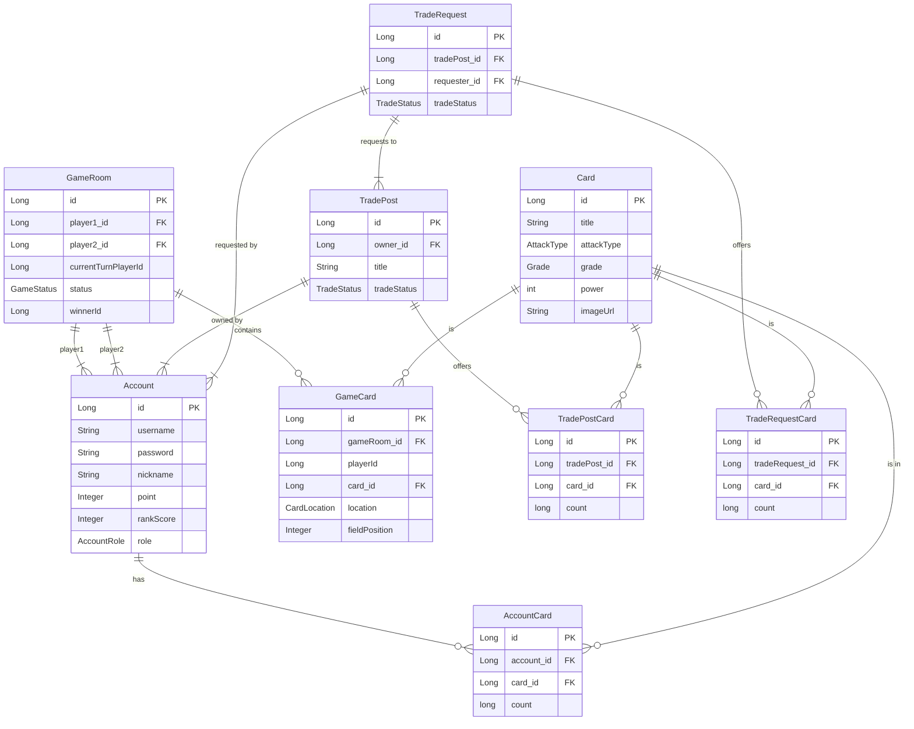

# 침착맨 온라인 카드게임 (침온카) - 실시간 카드 배틀 게임

## 📖 프로젝트 소개

- 개발 기간 : 25.04.28 ~ 25.08.08
- 개인 프로젝트

`침온카`는 웹소켓을 기반으로 한 실시간 1vs1 카드 배틀 게임입니다. 사용자들은 자신만의 덱을 구성하여 다른 플레이어와 전략적인 대결을 펼칠 수 있으며, 카드 교환 시스템을 통해 필요한 카드를 교환할 수 있습니다.

이 프로젝트는 Spring Boot와 Java 21을 기반으로 구축되었으며, 실시간 통신, 동시성 제어, 객체지향 설계 등 백엔드 개발의 다양한 기술적 과제를 해결하는 데 중점을 두었습니다.

---

## ✨ 주요 기능 (Features)

-   **유저 관리:**
    -   회원가입 및 로그인 (JWT 기반 인증)
    -   사용자 정보 조회 및 수정
-   **카드 시스템:**
    -   시즌별 카드 관리 (관리자)
    -   사용자 카드팩 뽑기 기능
    -   보유 카드 조회
-   **실시간 카드 배틀 게임:**
    -   웹소켓을 이용한 실시간 매칭 시스템
    -   턴 기반 카드 제출 및 전투 로직
    -   게임 결과 처리 및 기록
-   **카드 교환:**
    -   사용자 간 카드 교환 게시판
    -   교환 요청 및 수락/거절 기능
-   **기타:**
    -   AOP를 이용한 커스텀 로깅
    -   QueryDSL을 활용한 동적 쿼리
    -   P6Spy를 통한 SQL 로깅
    -   GitHub Actions를 이용한 CI/CD

---

## 🛠️ 기술 스택 (Tech Stack)

| 구분                    | 기술                                                                                     |
|-----------------------|----------------------------------------------------------------------------------------|
| **Backend**           | Java 21, Spring Boot 3.4.0, Spring Security, Spring Data JPA, QueryDSL, JWT, WebSocket |
| **Database**          | MySQL, H2 (for testing)                                                                |
| **Cloud**             | AWS [EC2, RDS, S3, Load Balancer, Route 53]                                            |
| **Tools & Libraries** | Lombok, P6Spy, Spring Retry, Gradle                                                    |
| **Monitoring**      | Prometheus, Grafana, Loki |

---

## 🏗️ 아키텍처 (Architecture)

이 프로젝트는 **계층형 아키텍처(Layered Architecture)**를 기반으로 설계되었습니다. 각 계층은 명확한 책임을 가지며, 이를 통해 코드의 재사용성과 유지보수성을 높였습니다.

```
  +--------------------------------------------------+
  |                 Client (Web Browser)             |
  +------------------------^-------------------------+
                           | (HTTP/WebSocket)
  +------------------------v-------------------------+
  |              Controller Layer (API)              |
  |       (User, Card, Game, Trade Controllers)      |
  +------------------------^-------------------------+
                           |
  +------------------------v-------------------------+
  |          Service Layer (Business Logic)          |
  |        (User, Card, Game, Trade Services)        |
  +------------------------^-------------------------+
                           |
  +------------------------v-------------------------+
  |           Repository Layer (Data Access)         |
  |           (JPA Repositories, QueryDSL)           |
  +------------------------^-------------------------+
                           |
  +------------------------v-------------------------+
  |                  Database (MySQL)                |
  +--------------------------------------------------+
```

-   **Controller Layer:** 클라이언트의 HTTP/WebSocket 요청을 받아 DTO를 통해 데이터를 검증하고 Service 계층에 전달합니다.
-   **Service Layer:** 핵심 비즈니스 로직을 수행하고 트랜잭션을 관리합니다.
-   **Repository Layer:** Spring Data JPA와 QueryDSL을 사용하여 데이터베이스와 상호작용합니다.
-   **Domain/Entity:** `entity` 패키지에 정의된 핵심 도메인 객체들로, 데이터베이스 테이블과 매핑됩니다.

---

## 🗃️ ERD (Entity Relationship Diagram)



---

## 📡 API 명세 (API Endpoints)

<details>
<summary><b>유저 (User)</b></summary>

-   `POST /api/signup`: 회원가입
-   `GET /api/signup/checkUsername`: 아이디 중복 확인
-   `GET /api/signup/checkNickname`: 닉네임 중복 확인
-   `POST /api/login`: 로그인 (Access Token, Refresh Token 발급)
-   `POST /api/token/logout`: 로그아웃
-   `POST /api/token/refresh`: Access Token 갱신
-   `GET /api/user/myInfo`: 내 정보 조회
-   `POST /api/user/checkPassword`: 비밀번호 확인
-   `PUT /api/user/update`: 회원 정보 수정 (프로필 이미지 포함)
-   `GET /api/user/gameRecords`: 게임 전적 확인

</details>

<details>
<summary><b>유저 관리 (Admin)</b></summary>

-   `GET /api/admin/user`: 전체 유저 조회
-   `PUT /api/admin/user/{accountId}/role`: 유저 Role 변경
-   `PUT /api/admin/user/{accountId}/point`: Point 지급

</details>

<details>
<summary><b>카드 (Card)</b></summary>

-   `GET /api/card`: 모든 카드 목록 조회
-   `GET /api/card/{id}`: 특정 카드 상세 정보 조회
-   `GET /api/card/seasons`: 모든 카드 시즌 목록 조회
-   `GET /api/card/season/{seasonId}`: 특정 시즌의 카드 목록 조회
-   `GET /api/card/mine`: 내가 보유한 카드 목록 조회
-   `GET /api/card/notMine`: 내가 보유하지 않은 카드 목록 조회
-   `GET /api/card/owner/{id}`: 특정 카드를 보유한 유저 목록 조회
-   `POST /api/card/open/{seasonId}`: 카드팩 뽑기

</details>

<details>
<summary><b>카드 관리 (Admin)</b></summary>

-   `POST /api/admin/card`: 새로운 카드 등록
-   `PUT /api/admin/card/{id}`: 카드 정보 수정
-   `DELETE /api/admin/card/{id}`: 카드 삭제
-   `POST /api/admin/card/season`: 새로운 시즌 등록

</details>

<details>
<summary><b>게임 (Game)</b></summary>

-   `POST /api/game/matching/join`: 게임 매칭 대기열 참가
-   `DELETE /api/game/matching/cancel`: 게임 매칭 취소
-   `@MessageMapping() /api/game/{gameRoomId}/info`: 게임 매칭 성공 시 상대 정보 및 내 카드 조회
-   `GET /api/game/check/{playerId}`: 해당 플레이어가 진행 중인 게임이 있는지 체크
-   `POST /api/game/{gameRoomId}/cardSubmit`: 카드 제출
-   `POST /api/game/{gameRoomId}/battle`: 카드 배틀 진행
-   `POST /api/game/{gameRoomId}/fieldBattle`: 필드 배틀 진행
-   `POST /api/game/{gameRoomId}/surrender`: 항복
-   `POST /api/game/{gameRoomId}/timeout`: 플레이어의 재연결 대기 시간(60초) 이후 최종 연결 상태 체크

</details>

<details>
<summary><b>거래 (Trade)</b></summary>

-   `GET /api/trade/list`: 거래 게시글 목록 조회 (검색 및 페이징)
-   `GET /api/trade/{id}`: 거래 게시글 상세 조회 (게시자가 올린 카드)
-   `GET /api/trade/request/{id}`: 특정 게시글에 온 거래 요청 목록 조회
-   `GET /api/trade/request/detail/{id}`: 거래 요청 상세 조회 (요청자가 올린 카드)
-   `POST /api/trade/post`: 거래 게시글 등록
-   `POST /api/trade/request/{id}`: 거래 요청
-   `POST /api/trade/complete/{id}`: 거래 수락 및 완료
-   `POST /api/trade/reject/{id}`: 거래 거절
-   `POST /api/trade/post/cancel/{id}`: 거래 게시글 등록 취소
-   `POST /api/trade/request/cancel/{id}`: 거래 요청 취소

</details>

---

## 🎯 핵심 로직 상세 설명

#### 1. 게임 진행

1.  **매칭:** 유저가 '게임' 메뉴를 누르면 이번 게임에 사용할 7장의 카드를 선택하기 위한 페이지로 이동합니다. 카드를 선택하고 제출하면 매칭 대기열에 등록됩니다. 서버는 대기 중인 유저 2명을 찾아 `GameRoom`을 생성하고, 각 유저가 선택한 7장의 `GameCard`를 지급하며 게임을 시작합니다.
2.  **선공 결정:** `GameRoom` 생성 시, 두 플레이어 중 한 명이 랜덤으로 선공 플레이어로 지정됩니다.
3.  **카드 제출:** 자신의 턴인 플레이어는 `손(Hand)`에 있는 카드 중 하나를 선택하여 필드에 제출합니다.
    *   `Player 1`의 카드는 필드 `[1]`번에, `Player 2`의 카드는 필드 `[6]`번에 놓입니다.
    *   카드를 제출하면, 해당 라인에 있던 기존 카드들은 상대방을 향해 한 칸씩 전진합니다. (예: `[1]`번 -> `[2]`번, `[6]`번 -> `[5]`번)
4.  **전투 발생:** 카드 전진 후, `Player 1`의 카드와 `Player 2`의 카드가 마주보고 있는 필드(`[3]`번과 `[4]`번)에 모두 카드가 존재할 경우 즉시 전투가 발생합니다.
5.  **턴 전환:** 카드 제출 및 전투 처리 후, 턴은 상대방에게 넘어갑니다.
6.  **필드 처리:** 전투가 발생한 이후 비어있는 필드는 다음과 같이 처리된다.
    *   `Player2`의 카드 제출 이후를 기준으로 한다. (즉, 카드 전투 이후 `Player1`의 턴일 경우)
    *   `Player1`의 카드가 승리하여 `[4]번` 필드 공백 -> `Player1`의 카드 제출로 `[1] - [2] - [3] - [4]` 필드를 차지한다
    *   `Player2`의 카드가 승리하여 `[3]번` 필드 공백 -> `Player1`의 카드 제출로 `[1] - [2] - [3]` 필드를 차지한다
7.  **게임 종료:**
    *   한 플레이어의 필드에 있는 카드가 모두 사라졌을 경우. 즉, 7장의 카드가 모두 `무덤(GRAVE)`로 이동했을 경우
    *   한 플레이어가 6개의 필드를 모두 점령했을 경우.
    *   (예외) 두 플레이어 모두 손에 카드가 없다면, 필드 맨 앞에 있는 카드끼리 계속해서 전투를 벌여 승패를 결정합니다.

#### 2. 전투 판정 로직 (`Card.match()`)

두 카드의 승패는 다음 3단계의 우선순위에 따라 결정됩니다.

1.  **공격 타입 (AttackType):** 가위바위보 상성 관계를 따릅니다.
    *   `바위` > `가위` > `보` > `바위`
    *   `ALL` 타입은 다른 모든 타입을 이깁니다.
    *   여기서 승패가 결정되면, 하위 조건은 비교하지 않습니다.

2.  **침투력 (Power):** 공격 타입이 비길 경우, 카드의 `power` 값을 비교합니다.
    *   `power`가 더 높은 카드가 승리합니다.
    *   여기서 승패가 결정되면, 하위 조건은 비교하지 않습니다.

3.  **등급 (Grade):** 공격 타입과 침투력까지 모두 비길 경우, 카드의 등급을 비교합니다.
    *   더 높은 등급의 카드가 승리합니다. (`SSR` > `SR` > `R` > `N` > `C` > `V`)
    *   모든 조건이 동일하여 완전히 비길 경우, 두 카드 모두 무덤(Grave)으로 이동합니다.

```java
// Card.java
public int match(Card other) {
    // 1. 공격 타입 비교
    int typeResult = matchType(this, other);
    if (typeResult != 0) {
        return typeResult;
    }

    // 2. 침투력 비교
    int powerResult = matchPower(this, other);
    if (powerResult != 0) {
        return powerResult;
    }

    // 3. 등급 비교
    return matchGrade(this, other);
}
```
---

## 🤔 트러블 슈팅 및 학습 내용 (Challenges & Learnings)

### 1. 카드 교환 기능의 동시성 문제 해결

**문제 상황:**   

카드 교환 시스템을 구현하면서 여러 동시성 문제를 마주했습니다. 예를 들어,
-   한 유저가 동시에 여러 개의 교환 요청을 보내고, 이 요청들이 거의 동시에 수락될 경우
-   교환이 완료되어 카드가 지급되는 시점에, 해당 유저가 카드팩을 개봉하여 같은 종류의 카드를 얻는 경우

이러한 상황들은 유저가 보유한 카드 수량(`AccountCard`의 `count`)을 정확하게 관리하는 데 있어 데이터 정합성 문제를 일으킬 수 있었습니다. 이 문제를 해결하기 위해 동시성 제어 기법이 필요했습니다.

**해결 과정:**

이때 `synchronized` 키워드는 `단일 JVM 프로세스` 내에서만 스레드 안전성을 보장하기 때문에,   
향후 트래픽 증가로 서버를 여러 대로 증설하는 **스케일 아웃(Scale-out)** 환경에서는 데이터 정합성을 보장할 수 없다고 판단했습니다.   
따라서 현재는 단일 서버로 운영되더라도, 미래의 확장성을 고려하여 분산 환경에서도 안전하게 동작하는 **낙관적 락 Optimistic Lock**을 채택하고,
낙관적 락이 발생한 경우 재시도 처리를 위해 **Spring Retry**를 도입했습니다.

1.  **낙관적 락 (`@Version`):**
    -   `AccountCard`와 같이 동시 접근이 예상되는 주요 엔티티에 `@Version` 어노테이션을 추가했습니다.
    -   이를 통해 트랜잭션 커밋 시점에 데이터의 변경 여부를 확인하고, 만약 다른 트랜잭션에 의해 데이터가 변경되었다면 `ObjectOptimisticLockingFailureException`을 발생시켜 데이터의 꼬임을 방지했습니다.

2.  **Spring Retry:**
    -   낙관적 락 실패는 일시적인 경합 상황일 가능성이 높다고 판단하여, 무조건 실패 처리하기보다는 재시도를 통해 정상 처리될 기회를 주기로 했습니다.
    -   `@Retryable` 어노테이션을 사용하여 낙관적 락 예외가 발생했을 때, 해당 로직(카드 지급 등)을 자동으로 몇 차례 재시도하도록 구현했습니다. 이를 통해 대부분의 동시성 이슈를 해결할 수 있을 것이라 기대하고 있습니다. 

3.  **최종 실패 처리:**
    -   만약 재시도마저 모두 실패할 경우, 해당 교환 정보를 `FailedTrade`라는 별도의 테이블에 기록하도록 구현했습니다.
    -   이는 추후 관리자가 원인을 파악하고 수동으로 데이터를 복구할 수 있는 최종적인 안전장치 역할을 합니다.

**학습 내용:**
-   `synchronized`만으로는 해결하기 어려운 분산 환경의 동시성 문제를 낙관적 락을 통해 효과적으로 제어할 수 있음을 배웠습니다.
-   Spring Retry를 활용하여 일시적인 데이터 경합을 유연하게 처리하고, 시스템의 안정성과 성공률을 높이는 방법을 터득했습니다.
-   실패를 대비한 보상 트랜잭션 및 로깅의 중요성을 깨닫고, 견고한 시스템을 설계하는 경험을 했습니다.

### 2. 비동기 처리와 트랜잭션 전파 문제 (교환 거절 로직)

**문제 상황:**   

한 거래 게시글에 여러 건의 교환 신청이 들어온 상황에서, 게시글 주인이 특정 신청(B)을 수락하면 나머지 신청(C, D, E...)들은 모두 거절 처리되어야 했습니다.   
이때 사용자 경험을 위해 B와의 교환 성공 처리는 **동기**로 즉시 응답을 주고, 나머지 C, D, E에 대한 거절 및 카드 롤백 처리는 **비동기**로 수행하여 응답 시간을 단축하고자 했습니다.

하지만 `@Async`를 통해 비동기 메서드를 호출하자 두 가지 큰 문제에 직면했습니다.

1.  **영속성 컨텍스트 단절:** 비동기 스레드에는 기존 트랜잭션의 영속성 컨텍스트가 전파되지 않아, 엔티티가 준영속(detached) 상태가 되어버렸습니다. 이로 인해 JPA가 변경 감지(dirty checking)를 할 수 없어 카드 롤백 로직이 정상적으로 동작하지 않았습니다.
2.  **트랜잭션 원자성:** 여러 개의 거절 처리를 하나의 비동기 트랜잭션으로 묶을 경우, 만약 D의 롤백 처리 중 오류가 발생하면 성공적으로 처리되었던 C의 롤백까지 모두 롤백되는 문제가 있었습니다. 각 거절 처리는 개별적인 트랜잭션으로 다루어져야 했습니다.

**해결 과정:**

1.  **영속성 컨텍스트 문제 해결:**
    -   비동기 메서드에 엔티티 객체 자체를 넘기는 대신, 필요한 데이터의 **ID 값**을 파라미터로 전달했습니다.
    -   비동기 메서드 내에서 전달받은 ID를 사용해 `Repository`에서 엔티티를 다시 조회했습니다. 이를 통해 새로운 스레드의 영속성 컨텍스트에 해당 엔티티를 영속 상태로 로드하여 문제를 해결했습니다.
    -   이 과정에서 트랜잭션은 AOP 프록시를 통해 동작하므로, `@Transactional` 메서드를 내부(self-invocation)에서 호출하면 프록시를 타지 않아 트랜잭션이 적용되지 않는다는 점을 다시 한번 상기하고, 빈(Bean)을 통해 외부에서 호출하는 구조로 설계했습니다.

2.  **트랜잭션 전파 문제 해결:**
    -   개별 롤백 로직을 담은 메서드에 `@Transactional(propagation = Propagation.REQUIRES_NEW)` 옵션을 적용했습니다.
    -   이 옵션은 해당 메서드가 호출될 때마다 항상 새로운 트랜잭션을 시작하도록 보장합니다. 덕분에 C, D, E의 롤백 처리가 서로에게 영향을 주지 않는 독립적인 트랜잭션으로 실행될 수 있었습니다.
    -   만약 특정 사용자의 롤백이 재시도(Spring Retry) 후에도 최종 실패하면, 오직 해당 건만 `FailedTrade` 테이블에 기록되어 다른 사용자의 처리에 영향을 주지 않도록 구현했습니다.

**학습 내용:**
-   `@Async` 환경에서 영속성 컨텍스트가 어떻게 동작하는지, 그리고 ID를 통해 엔티티를 다시 조회하여 영속 상태를 유지하는 해결 방법을 명확히 이해하게 되었습니다.
-   `Propagation.REQUIRES_NEW`와 같은 트랜잭션 전파 전략을 활용하여, 복잡한 비즈니스 로직 내에서 트랜잭션의 범위를 세밀하게 제어하는 방법을 학습했습니다.
-   동기/비동기 로직을 혼합하여 설계할 때 발생할 수 있는 다양한 문제를 예측하고, 견고하고 안정적인 시스템을 구축하는 경험을 쌓았습니다.

### 3. 트랜잭션과 비동기 호출의 실행 순서 문제 해결 (이벤트 기반 처리)

**문제 상황:**

`tradeComplete`와 같이 동기적인 메인 로직과 비동기적인 후처리 로직이 함께 있는 경우, 단순히 `@Async` 메서드를 호출하는 것만으로는 문제가 있었습니다.   
메인 로직의 트랜잭션이 `Retryable`에 의해 롤백되고 재시도될 때마다, 이미 호출된 비동기 메서드는 계속해서 실행되는 불필요한 호출이 발생했습니다.   
따라서 동기 로직이 **최종적으로 성공했을 때 단 한 번만** 비동기 로직이 실행되도록 보장할 필요가 있었습니다.

**해결 과정:**
이 문제를 해결하기 위해 Spring의 **이벤트 발행/구독 모델**을 도입했습니다.

1.  **이벤트 정의:** `TradeCompleteOrCancelEvent`와 같이 비동기 처리에 필요한 데이터를 담는 이벤트를 정의했습니다.
2.  **이벤트 발행:** 동기 로직을 수행하는 `TradeService`에서는 비동기 서비스(`TradeAsyncService`)를 직접 호출하는 대신, `ApplicationEventPublisher`를 주입받아 `publishEvent()` 메서드로 이벤트를 발행했습니다.
3.  **이벤트 리스너:** 비동기 로직을 담고 있는 `TradeAsyncService`의 메서드에 `@TransactionalEventListener` 어노테이션을 추가했습니다.
    -   이 어노테이션은 기본적으로 **현재 진행 중인 트랜잭션이 성공적으로 커밋(commit)된 후에만** 이벤트를 수신하여 메서드를 실행시킵니다.
    -   덕분에 `TradeService`의 `tradeComplete` 메서드가 재시도를 거듭하다 최종적으로 실패하고 롤백되면 이벤트는 발행되지 않고, 최종적으로 성공했을 때만 이벤트가 발행되어 비동기 로직이 정확히 한 번만 실행되도록 보장할 수 있었습니다.

**학습 내용:**
-   `@TransactionalEventListener`를 통해 트랜잭션의 생명주기와 비동기 로직의 실행 시점을 동기화하는 방법을 배웠습니다.
-   서비스 간의 직접적인 의존성을 줄이고 이벤트라는 매개체를 통해 느슨하게 결합(Loosely Coupled)된 아키텍처를 설계하는 경험을 했습니다. 이는 시스템의 유연성과 확장성을 높이는 데 큰 도움이 되었습니다.
-   복잡한 동기/비동기 흐름 속에서 발생할 수 있는 미묘한 실행 순서 문제를 이벤트 기반 아키텍처를 통해 명확하고 안정적으로 해결할 수 있음을 깨달았습니다.

### 4. WebSocket을 이용한 게임 도중 플레이어의 이탈

**문제 상황:**

게임을 진행 중 새로 고침이나 url을 조작한 페이지 이동, 탭/창 닫기와 같은 외부 요인으로 인해 웹 소켓의 연결이 끊기는 경우가 발생 할 수 있습니다.
내부적인 이동은 react의 `useBlocker`를 사용하여 막았으나 외부요인을 컨트롤하는데 어려움이 있었습니다.

**해결 과정:**
이 문제를 해결하기 위해 `SimpMessageHeaderAccessor`와 `SessionDisconnectEvent`를 사용하여 웹소켓의 SessionId를 관리하도록 했습니다.

1. **Session ID 관리:** `SimpMessageHeaderAccessor`를 통해 웹 소켓을 연결할 때 SessionId를 획득, 획득한 SessionId를 저장하고 연결이 끊길 때 `SessionDisconnectEvent`를 통해 끊어진 SessionId를 파악해 게임 도중 연결이 끊겼다면 상대 플레이어에게 연결이 끊겼다는 메세지를 전달하고 60초 동안 재연결을 기다린다고 알려줍니다.
2. **연결 끊김 타이밍 판단:** 웹소켓의 연결은 `게임 매칭`, `게임 룸` 2군데에서 발생하기 때문에 어느 타이밍에 연결이 끊겼는지 판단해야했습니다. 이를 위해 `게임 매칭` 시에 연결 헤더에 `playerId` 값을 보내도록 하고 `StompHeaderInterceptor`를 사용해 해당 값을 관리하도록 했습니다. 이후 `SessionDisconnectEvent`에서 `sessionAttributes.containsKey("playerId")` 조건으로 매칭중에 끊겼는지 게임 진행 중에 끊겼는지 판단했습니다.
3. **게임 종료 처리:** 게임 중 연결이 끊겼을 시 60초의 재접속 대기 시간을 주고 시간 내에 접속이 되면 게임을 계속 진행, 접속이 되지 않으면 이탈한 플레이어의 패배로 게임을 종료합니다.

**학습 내용:**
- 웹소켓의 연결/끊김 시 SessionID 값을 확인할 수 있다는 걸 알았고, `MessageHeaderAccessor`와 `SessionDisconnectEvent`로 쉽게 해당 Session ID 값을 관리하는 방법을 배웠습니다.
- 웹소켓을 연결할 때 헤더에 특정 값을 담을 수 있고 해당 값을 `StompHeaderInterceptor`을 통해 관리하는 방법을 배웠습니다.
